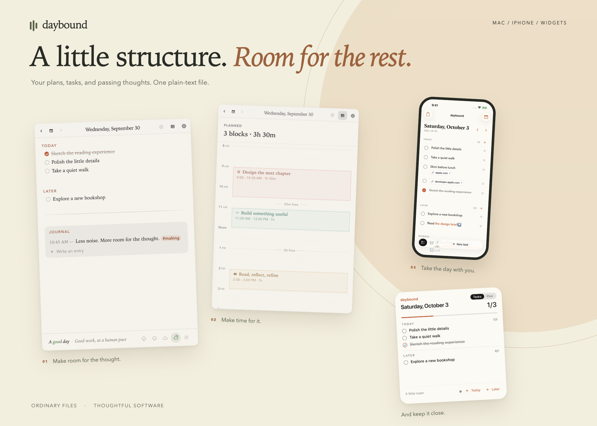
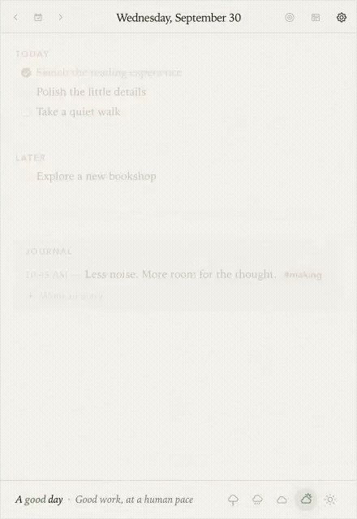
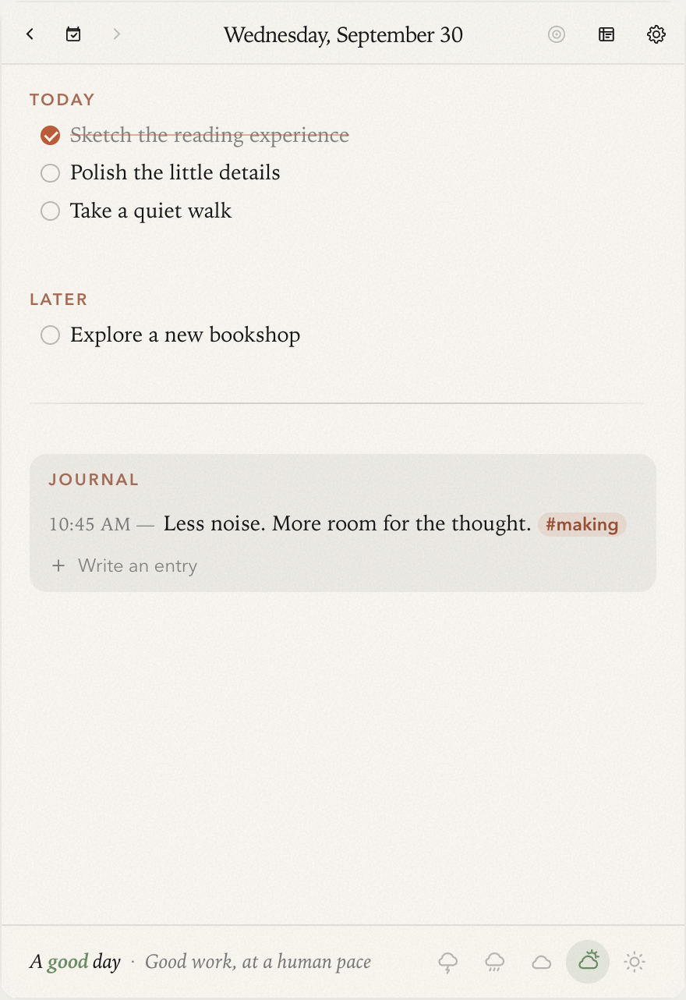
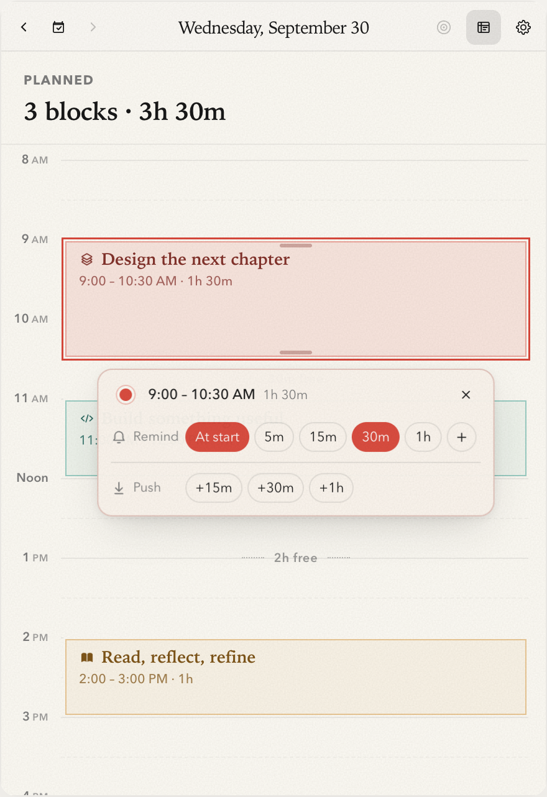
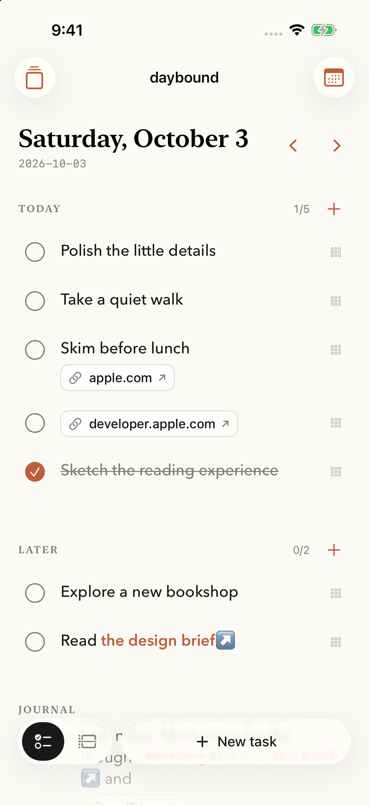
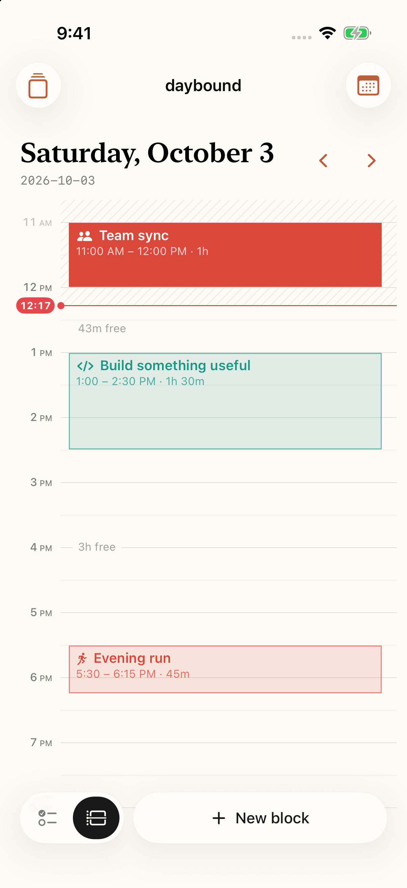
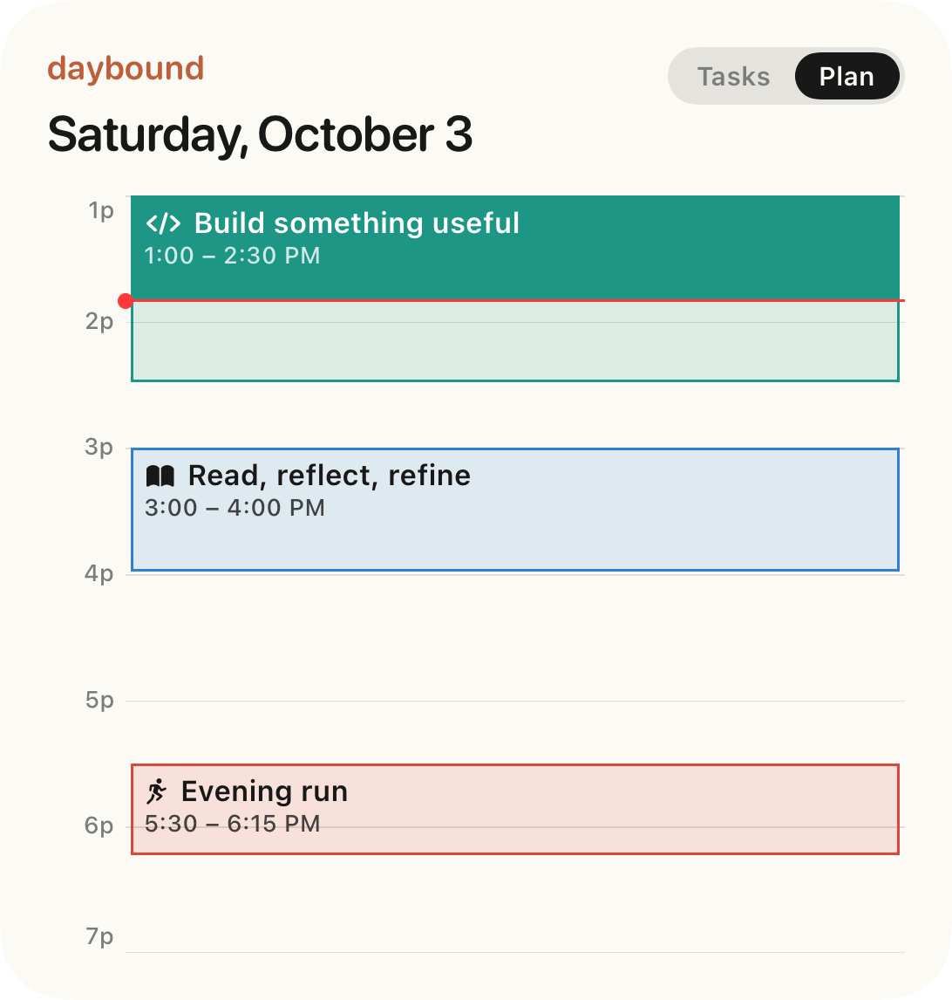
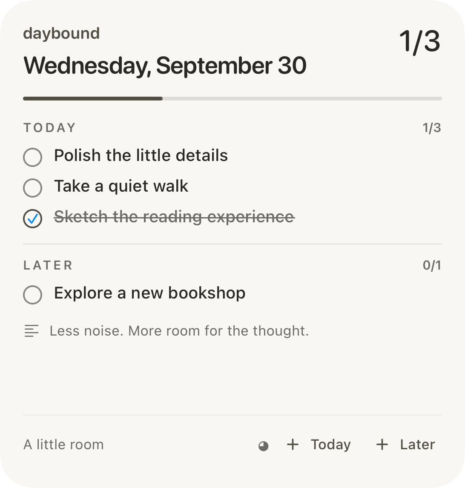

<strong>A day. A page. A little peace.</strong> Plans, tasks, and passing thoughts—one plain Markdown file per day.

<a href="https://daybound.page">Explore the experience ↗</a> · <a href="https://daybound.page/#access">Request early access</a> · <a href="https://daybound.page/#planner">The planner</a> · <a href="https://daybound.page/#pocket">iPhone & widgets</a> · <a href="ENGINEERING.md">Engineering case study</a>

An independent product and engineering project by Dhiraj. React 19 · CodeMirror 6 · Tauri 2 · Rust · SwiftUI · JavaScriptCore · WidgetKit

## Small enough for every day. Thoughtful enough to keep.

Daybound lives in the Mac menubar, travels with you on iPhone, and keeps the next thing close on your Home Screen. Write directly on the page, give the day a visual plan, and come back to a journal that stays in ordinary `YYYY-MM-DD.md` files.

This public repository is the **product showcase and engineering case study**. The app source remains private. Explore the [live site](https://daybound.page) for interactive illustrations, full-size screenshots, themes, and the architecture walkthrough.

## The day, in motion

Recorded from the real Mac components in an isolated browser preview, using fictional notes. <a href="https://daybound.page/#experience">Watch the video ↗</a>

## Make room for the thought. Make time for the work.

<table><tr><td width="50%" align="center"></td><td width="50%" align="center"></td></tr><tr><td align="center"><strong>A quietly editable page.</strong> Live Markdown, task reordering, timestamped journal entries, links, tags, mood, and daily carry-forward.</td><td align="center"><strong>A plan that leaves room for life.</strong> Move and resize blocks, preview pushes, set reminders, record outcomes, and create follow-up sessions.</td></tr></table>

The editor and planner are two views of one document. A gesture changes the Markdown; the timeline does not maintain a second schedule database. A native Rust clock keeps the menubar readout current while the hidden webview sleeps.

## The same day, a little closer

<table><tr><td width="50%" align="center"></td><td width="50%" align="center"></td></tr><tr><td align="center"><strong>A native place for the small moments.</strong> Tasks, rich links, journal, mood, and five themes in SwiftUI.</td><td align="center"><strong>The plan comes with you.</strong> Shared document rules, native block controls, reminders, and outcomes.</td></tr></table>

<table><tr><td width="50%" align="center"></td><td width="50%" align="center"></td></tr><tr><td align="center"><strong>See what comes next.</strong> A current-block readout and a miniature timeline.</td><td align="center"><strong>Keep the thread.</strong> Today, Later, and task shortcuts.</td></tr></table>

Widgets offer small, medium, and large layouts. An App Intent switches Tasks and Plan without launching the app. They read a derived snapshot refreshed by the phone; edits made elsewhere appear after the phone reloads the note. iCloud controls file delivery timing.

## The engineering behind the quiet

| Design decision | Why it matters |
| --- | --- |
| One TypeScript document engine, shared with iPhone through JavaScriptCore | Both platforms interpret and rewrite the same Markdown dialect. |
| CodeMirror live preview with minimal document diffs | Reading and editing share a surface; programmatic changes preserve the caret. |
| Document-based plan rewrites | Movement, outcomes, and reminders remain part of the file you own. |
| Native Rust menubar and OS reminders | Time-sensitive work continues outside the hidden webview. |
| SwiftUI + WidgetKit with an app-group snapshot | Native presentation with explicit widget freshness boundaries. |
| Conflict checks before iPhone saves | A newer file is offered for resolution instead of silently overwritten. |

[Read the architecture, tradeoffs, and verification approach →](ENGINEERING.md)

## About this showcase

All notes are fictional. Mac screens are renders of the actual app components; iPhone screens are native Simulator captures; widgets are native layouts rendered in an isolated SwiftUI host. The browser demo is a separate product illustration, not the app implementation. No public app download or App Store distribution is offered here.

Daybound began as a personal fork of [Daily by hellorashid](https://github.com/hellorashid/daily). That menubar notebook provided the starting point; Daybound's subsequent work includes live-preview editing, planning, journaling, shared document rules, and native iPhone and widget experiences.
